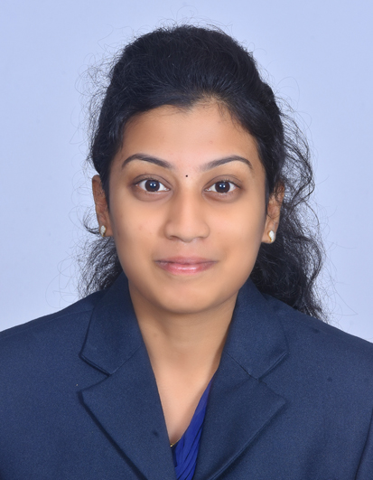

 :email:[deepuamri@gmail.com](mailto:deepuamri@gmail.com)| 
 :telephone_receiver:[8838331990](tel:8838331990)

# DEEPIKA RAMESH
 ## <ins> Career Objective: </ins>
   To pursue a highly challenging and creative career, where I can apply my existing knowledge and creativity
## <ins> Education: </ins>
 |Sl.No|QUALIFICATION|NAME OF THE INSTITUTE|YEAR OF PASSING|PERCANTAGE|
 |-----|-------------|---------------------|---------------|----------|
 |1|B.tech(IT)|Velammal College Of Engineering And Technology, Madurai|May 2020|7.34|
 |2|H.S.C|C.S.Ramachary Higher Secondary School, Madurai|May 2016|88%|
 |3|S.S.L.C|Anusha Vidyalaya Matriculation Higher Secondary School, Madurai|May 2020|96%|

## <ins>Area Of Interest: </ins>
- Database Management System

## <ins>Mini Projects: </ins>
- Course Registration System- HTML,CSS,PHP
- E-Billing Application

## <ins>Workshops: </ins>
- **Natural Language Processing**  
Coimbatore Institute Of Technology 
- **Mobile App Development**  
Velammal College Of Engineering And Technology

## <ins>In-Plant Trainings: </ins>
- **PYTHON TRAINING**  
Kalvi Technologies, Madurai. 
*May 2017*

## <ins>Paper Presentation: </ins>
- **FLIGHT ALTITUDE MONITORING SYSTEM (FAMS)** at Bannari Amman College Of Engineering, Erode

## <ins>Cocurricular Activity: </ins>
- Active Invlovement in Quality Circle
- Member Of Eco Club

## <ins>Personal Profile: </ins>
**Father's Name**    : L.Ramesh

**Mother's Name**    : R.Alamu

**Date Of Birth**    : 27.07.1999

**Nationality**      : Indian

**Hobbies**          : Listening Music

**Languages Known**  : Tamil & English

**Passport**         : In Process

